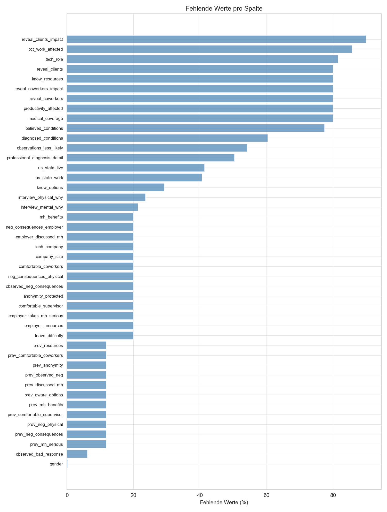
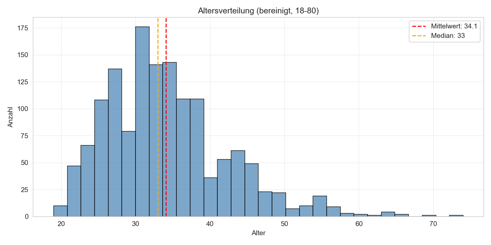
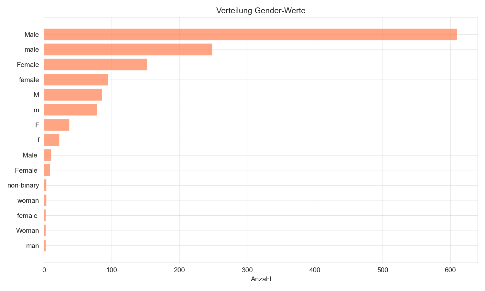
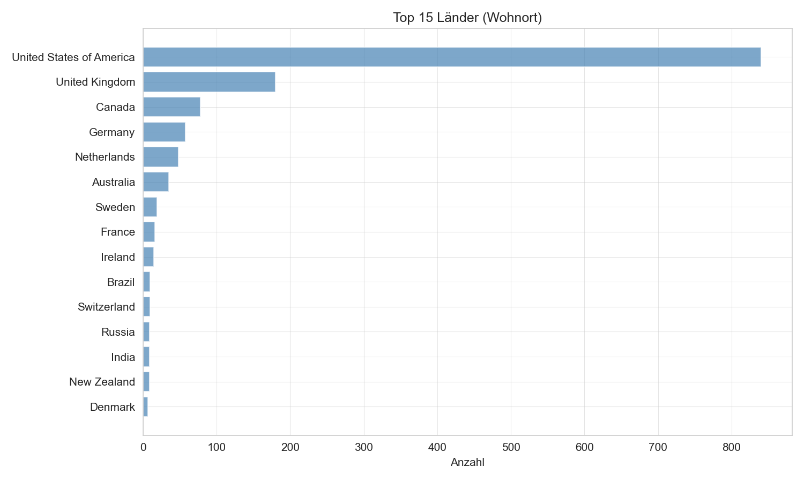
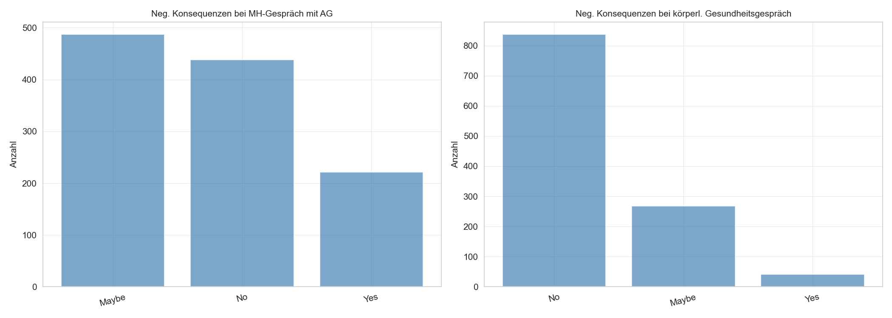
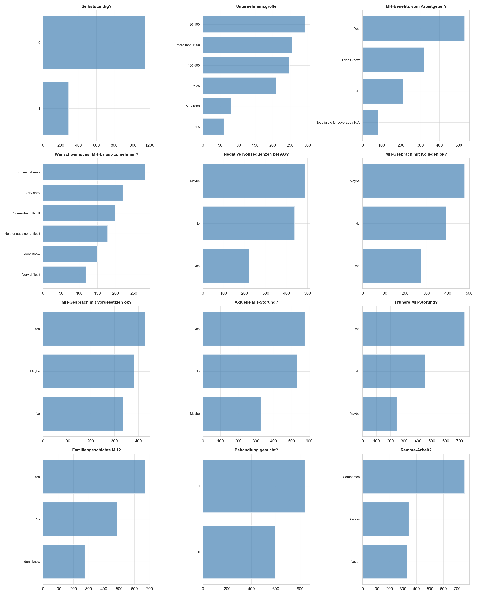

# EDA Report – OSMI Mental Health in Tech Survey 2016

## Datenstruktur
**Zeilen:** 1433  
**Spalten:** 63
```
<class 'pandas.DataFrame'>
RangeIndex: 1433 entries, 0 to 1432
Data columns (total 63 columns):
 #   Column                         Non-Null Count  Dtype  
---  ------                         --------------  -----  
 0   self_employed                  1433 non-null   int64  
 1   company_size                   1146 non-null   str    
 2   tech_company                   1146 non-null   float64
 3   tech_role                      263 non-null    float64
 4   mh_benefits                    1146 non-null   str    
 5   know_options                   1013 non-null   str    
 6   employer_discussed_mh          1146 non-null   str    
 7   employer_resources             1146 non-null   str    
 8   anonymity_protected            1146 non-null   str    
 9   leave_difficulty               1146 non-null   str    
 10  neg_consequences_employer      1146 non-null   str    
 11  neg_consequences_physical      1146 non-null   str    
 12  comfortable_coworkers          1146 non-null   str    
 13  comfortable_supervisor         1146 non-null   str    
 14  employer_takes_mh_serious      1146 non-null   str    
 15  observed_neg_consequences      1146 non-null   str    
 16  medical_coverage               287 non-null    float64
 17  know_resources                 287 non-null    str    
 18  reveal_clients                 287 non-null    str    
 19  reveal_clients_impact          144 non-null    str    
 20  reveal_coworkers               287 non-null    str    
 21  reveal_coworkers_impact        287 non-null    str    
 22  productivity_affected          287 non-null    str    
 23  pct_work_affected              204 non-null    str    
 24  has_previous_employers         1433 non-null   int64  
 25  prev_mh_benefits               1264 non-null   str    
 26  prev_aware_options             1264 non-null   str    
 27  prev_discussed_mh              1264 non-null   str    
 28  prev_resources                 1264 non-null   str    
 29  prev_anonymity                 1264 non-null   str    
 30  prev_neg_consequences          1264 non-null   str    
 31  prev_neg_physical              1264 non-null   str    
 32  prev_comfortable_coworkers     1264 non-null   str    
 33  prev_comfortable_supervisor    1264 non-null   str    
 34  prev_mh_serious                1264 non-null   str    
 35  prev_observed_neg              1264 non-null   str    
 36  interview_physical             1433 non-null   str    
 37  interview_physical_why         1095 non-null   str    
 38  interview_mental               1433 non-null   str    
 39  interview_mental_why           1126 non-null   str    
 40  mh_hurts_career                1433 non-null   str    
 41  coworkers_view_neg             1433 non-null   str    
 42  share_friends_family           1433 non-null   str    
 43  observed_bad_response          1344 non-null   str    
 44  observations_less_likely       657 non-null    str    
 45  family_history                 1433 non-null   str    
 46  past_disorder                  1433 non-null   str    
 47  current_disorder               1433 non-null   str    
 48  diagnosed_conditions           568 non-null    str    
 49  believed_conditions            322 non-null    str    
 50  professionally_diagnosed       1433 non-null   str    
 51  professional_diagnosis_detail  711 non-null    str    
 52  sought_treatment               1433 non-null   int64  
 53  interferes_treated             1433 non-null   str    
 54  interferes_untreated           1433 non-null   str    
 55  age                            1433 non-null   int64  
 56  gender                         1430 non-null   str    
 57  country_live                   1433 non-null   str    
 58  us_state_live                  840 non-null    str    
 59  country_work                   1433 non-null   str    
 60  us_state_work                  851 non-null    str    
 61  work_position                  1433 non-null   str    
 62  remote_work                    1433 non-null   str    
dtypes: float64(3), int64(4), str(56)
memory usage: 705.4 KB

```
## Fehlende Werte
| Spalte | Fehlend | Prozent |
|--------|---------|---------|
| reveal_clients_impact | 1289 | 90.0% |
| pct_work_affected | 1229 | 85.8% |
| tech_role | 1170 | 81.6% |
| medical_coverage | 1146 | 80.0% |
| reveal_clients | 1146 | 80.0% |
| reveal_coworkers | 1146 | 80.0% |
| reveal_coworkers_impact | 1146 | 80.0% |
| know_resources | 1146 | 80.0% |
| productivity_affected | 1146 | 80.0% |
| believed_conditions | 1111 | 77.5% |
| diagnosed_conditions | 865 | 60.4% |
| observations_less_likely | 776 | 54.2% |
| professional_diagnosis_detail | 722 | 50.4% |
| us_state_live | 593 | 41.4% |
| us_state_work | 582 | 40.6% |
| know_options | 420 | 29.3% |
| interview_physical_why | 338 | 23.6% |
| interview_mental_why | 307 | 21.4% |
| comfortable_supervisor | 287 | 20.0% |
| neg_consequences_employer | 287 | 20.0% |
| leave_difficulty | 287 | 20.0% |
| anonymity_protected | 287 | 20.0% |
| neg_consequences_physical | 287 | 20.0% |
| observed_neg_consequences | 287 | 20.0% |
| employer_takes_mh_serious | 287 | 20.0% |
| comfortable_coworkers | 287 | 20.0% |
| company_size | 287 | 20.0% |
| mh_benefits | 287 | 20.0% |
| tech_company | 287 | 20.0% |
| employer_discussed_mh | 287 | 20.0% |
| employer_resources | 287 | 20.0% |
| prev_mh_serious | 169 | 11.8% |
| prev_observed_neg | 169 | 11.8% |
| prev_resources | 169 | 11.8% |
| prev_neg_consequences | 169 | 11.8% |
| prev_discussed_mh | 169 | 11.8% |
| prev_aware_options | 169 | 11.8% |
| prev_mh_benefits | 169 | 11.8% |
| prev_anonymity | 169 | 11.8% |
| prev_comfortable_coworkers | 169 | 11.8% |
| prev_neg_physical | 169 | 11.8% |
| prev_comfortable_supervisor | 169 | 11.8% |
| observed_bad_response | 89 | 6.2% |
| gender | 3 | 0.2% |

Selbstständige: 287 | Fehlende Werte bei `company_size`: 287 | Übereinstimmung: True

## Datentypen
```
str        56
int64       4
float64     3
Name: count, dtype: int64

Gesamtzahl Spalten: 63
```
## Alter
| | Wert |
|--|------|
| count | 1433.00 |
| mean | 34.29 |
| std | 11.29 |
| min | 3.00 |
| 25% | 28.00 |
| 50% | 33.00 |
| 75% | 39.00 |
| max | 323.00 |

Ausreißer (< 18 oder > 80): 5 | Werte: [3, 15, 17, 99, 323]

## Gender
Unique Rohwerte: 70 | Fehlende Werte: 3
Unique nach Normalisierung (lowercase/strip): 54

| Normalisiert | Rohwerte |
|-------------|----------|
| afab | `AFAB` |
| agender | `Agender` |
| androgynous | `Androgynous` |
| bigender | `Bigender` |
| cis female | `Cis female ` |
| cis male | `Cis male`, `cis male`, `Cis Male` |
| cis man | `cis man` |
| cis-woman | `Cis-woman` |
| cisdude | `cisdude` |
| cisgender female | `Cisgender Female` |
| dude | `Dude` |
| enby | `Enby` |
| f | `F`, `f` |
| fem | `fem` |
| female | `Female`, `female`, `female `, `Female `, ` Female` |
| female (props for making this a freeform field, though) | `Female (props for making this a freeform field, though)` |
| female assigned at birth | `Female assigned at birth ` |
| female or multi-gender femme | `Female or Multi-Gender Femme` |
| female-bodied; no feelings about gender | `female-bodied; no feelings about gender` |
| female/woman | `female/woman` |
| fluid | `Fluid` |
| fm | `fm` |
| genderfluid | `Genderfluid` |
| genderfluid (born female) | `Genderfluid (born female)` |
| genderflux demi-girl | `Genderflux demi-girl` |
| genderqueer | `genderqueer`, `Genderqueer` |
| genderqueer woman | `genderqueer woman` |
| human | `Human`, `human` |
| i identify as female. | `I identify as female.` |
| i'm a man why didn't you make this a drop down question. you should of asked sex? and i would of answered yes please. seriously how much text can this take? | `I'm a man why didn't you make this a drop down question. You should of asked sex? And I would of answered yes please. Seriously how much text can this take? ` |
| m | `M`, `m` |
| mail | `mail` |
| male | `Male`, `male`, `Male `, `male `, `MALE` |
| male (cis) | `Male (cis)` |
| male (trans, ftm) | `Male (trans, FtM)` |
| male 9:1 female, roughly | `male 9:1 female, roughly` |
| male. | `Male.` |
| male/genderqueer | `Male/genderqueer` |
| malr | `Malr` |
| man | `man`, `Man` |
| mtf | `mtf` |
| m| | `M|` |
| nb masculine | `nb masculine` |
| non-binary | `non-binary` |
| nonbinary | `Nonbinary` |
| none of your business | `none of your business` |
| other | `Other` |
| other/transfeminine | `Other/Transfeminine` |
| queer | `Queer` |
| sex is male | `Sex is male` |
| transgender woman | `Transgender woman` |
| transitioned, m2f | `Transitioned, M2F` |
| unicorn | `Unicorn` |
| woman | `Woman`, `woman` |

## Geographische Verteilung
Verschiedene Länder: 53 | Anteil USA: 58.6%

## Aktuelle MH-Störung vs. Behandlung gesucht
| | 0 | 1 | All |
|--|--|--|--|
| Maybe | 145 | 182 | 327 |
| No | 390 | 141 | 531 |
| Yes | 59 | 516 | 575 |
| All | 594 | 839 | 1433 |
## Negative Konsequenzen bei Gespräch mit Arbeitgeber

## Weitere Verteilungen

